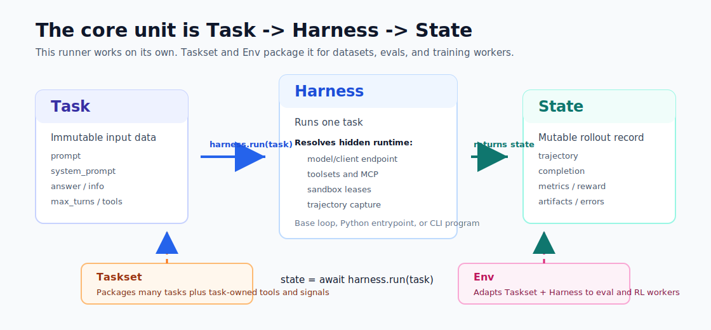

# Verifiers v1

`verifiers.v1` is the Taskset/Harness API for reusable eval and training
environments.

- `Taskset` defines what is being attempted.
- `Harness` defines how the model or agent attempts it.
- `Env` adapts one taskset/harness pair to the existing eval/training worker
  API.

Start with [`docs/byo-harness.md`](../../docs/byo-harness.md) when authoring an
environment. Use [`docs/reference.md`](../../docs/reference.md) for API lookup
and [`RE_MIGRATION.md`](RE_MIGRATION.md) for migration notes.

## Mental Model



v1 is data-first:

- `Task` is immutable, serializable input data.
- `State` is mutable, serializable rollout output.
- Runtime handles such as clients, sandboxes, MCP sessions, and tool backends
  are process-local and reached through state helpers while a rollout is active.
- Tasksets and harnesses are configured through strict Pydantic config objects.

## Golden Loader Shape

Environment packages expose typed child loaders and one tiny root loader:

```python
import verifiers as vf


class ReverseTasksetConfig(vf.TasksetConfig):
    system_prompt: vf.SystemPrompt = "Reverse text exactly."


class ReverseTaskset(vf.Taskset[ReverseTasksetConfig]):
    def load_tasks(self, split: vf.TaskSplit = "train") -> vf.Tasks:
        if split == "eval":
            return []
        return [
            {
                "prompt": [{"role": "user", "content": "Reverse abc."}],
                "answer": "cba",
                "max_turns": 1,
            }
        ]

    @vf.reward(weight=1.0)
    async def exact(self, task: vf.Task, state: vf.State) -> float:
        messages = vf.get_messages(state.get("completion") or [], role="assistant")
        response = str(messages[-1].content or "") if messages else ""
        return float(response.strip() == task["answer"])


def load_taskset(config: ReverseTasksetConfig) -> ReverseTaskset:
    return ReverseTaskset(config=config)


def load_environment(config: vf.EnvConfig) -> vf.Env:
    """Loader pattern for all Taskset/Harness environments."""
    return vf.Env(
        taskset=vf.load_taskset(config=config.taskset),
        harness=vf.load_harness(config=config.harness),
    )
```

Add `load_harness(config: MyHarnessConfig)` only when the package owns reusable
execution behavior:

```python
class MyHarnessConfig(vf.HarnessConfig):
    program: vf.ProgramConfig = vf.ProgramConfig(fn="my_env.agent:run")


class MyHarness(vf.Harness[MyHarnessConfig]):
    pass


def load_harness(config: MyHarnessConfig) -> MyHarness:
    return MyHarness(config=config)
```

Do not subclass `EnvConfig` to narrow child config types. The child loader
annotations define `[env.taskset]` and `[env.harness]`.

Start with a taskset and the base harness. Add a custom harness only when the
environment owns a reusable execution protocol, such as a command agent,
third-party framework adapter, endpoint interceptor, primary sandbox placement,
or program runner.

## Ownership

| Object | Owns |
| --- | --- |
| `Taskset` | Task data, task loading, task prompts, task controls, task tools, users, metrics, rewards, and task-specific lifecycle. |
| `Harness` | Rollout execution, programs, model/client defaults, endpoint interception, primary sandbox placement, command/framework adapters, and execution artifacts. |
| `Env` | Worker adapter for one taskset/harness pair. |

Tasksets own the domain. Harnesses own execution. If a tool defines the task's
action space or success condition, put it on the taskset. If code describes how
an arbitrary task is attempted, put it on the harness.

## Core Contracts

### Task

`Task` is immutable and serializable. `task["prompt"]` must not contain system
messages. Use top-level fields for task controls:

| Field | Meaning |
| --- | --- |
| `prompt` | User/developer/tool messages. |
| `system_prompt` | Per-task taskset-side system prompt override. |
| `answer` | Reference answer or target data. |
| `info` | Serializable metadata. |
| `max_turns` | Per-task base-loop limit. |
| `toolsets` / `tools` | Visibility controls for toolsets and tools. |
| `sandbox` | Per-task sandbox override. |
| `program` | Task-owned program files, dirs, setup, env, artifacts, bindings, and args. |

Use `max_turns`, `sandbox`, `program`, and visibility fields in tasks only when
they genuinely vary by example. Do not copy config defaults or
framework-managed IDs into task rows.

### State

`State` is mutable during rollout and serializable before return. It stores
trajectory, completion, metrics, reward, timing, artifacts, errors, and any
environment output.

Use state helpers for active runtime resources:

- `state.get_model()`
- `state.get_client(...)`
- `state.get_endpoint_config(...)`
- `state.get_max_turns(default)`
- `state.get_tools()`
- `state.add_tool("toolset_name", tool)`

### Config

Config values must be serializable. Use import refs for callables in TOML or
package config. Put task fields on `TasksetConfig`; put execution fields on
`HarnessConfig`.

Important owner config fields:

- `system_prompt`
- `user`
- `toolsets`
- `objects`
- `bindings`
- `artifacts`
- lifecycle lists such as `setups`, `updates`, `metrics`, `rewards`, and
  `cleanups`
- `scoring`

`Taskset.__init__`, `Harness.__init__`, and `User.__init__` are final.
Customize through config, public load methods, lifecycle decorators, and
program config.

## System Prompts

System prompts resolve per task during `Harness.setup_state(...)`.

- `T` is the resolved taskset side: `task["system_prompt"]` when present,
  otherwise `TasksetConfig.system_prompt`.
- `H` is the harness side: `HarnessConfig.system_prompt`.

`HarnessConfig.system_prompt_strategy` chooses the result:

| Strategy | Meaning |
| --- | --- |
| `HT` | Harness side followed by resolved taskset side. Default. |
| `TH` | Resolved taskset side followed by harness side. |
| `H_OR_T` | Harness side when present, otherwise resolved taskset side. |
| `T_OR_H` | Resolved taskset side when present, otherwise harness side. |
| `H` | Harness side only. |
| `T` | Resolved taskset side only. |
| `REJECT` | Error if both sides are present. |

Use `vf.SystemPromptConfig(path="system_prompt.txt")` for file-backed prompts.
Override `load_system_prompt(config)` only when prompt construction is computed.

## Tasksets

Tasksets load train and eval data through `load_tasks(split=...)`:

```python
class MyTaskset(vf.Taskset[MyTasksetConfig]):
    def load_tasks(self, split: vf.TaskSplit = "train") -> vf.Tasks:
        ...
```

`vf.Tasks` can be a `datasets.Dataset`, an iterable of serializable records, or
an iterable of `vf.Task` objects. `Taskset.get_dataset()` calls
`load_tasks(split="train")`; `Taskset.get_eval_dataset()` calls
`load_tasks(split="eval")`.

Prefer returning a `datasets.Dataset` directly when source columns already
match the task contract, such as `question` and `answer`. Hardcode fixed
upstream split names inside `load_tasks(split=...)`. Only expose
split-name config when the upstream split choice is genuine user-space
configuration, not the way v1 decides whether eval exists. Return `[]` for
`split == "eval"` when the taskset has no explicit eval source; `vf.Env` treats the empty
split as an absent eval dataset so the base environment can fall back to train
data with its standard warning.

Use tasksets for:

- dataset loading;
- task-owned tools;
- user simulators;
- task-specific setup/update/cleanup;
- metrics, rewards, advantages, and stop conditions.

## Harnesses And Programs

Harnesses run tasks. The base harness is endpoint-backed and supports the
default tool loop.

`HarnessConfig.program` controls executable behavior:

| Form | Meaning |
| --- | --- |
| `vf.ProgramConfig()` | Base endpoint-backed tool loop. |
| `vf.ProgramConfig(base=True)` | Explicit base loop. |
| `vf.ProgramConfig(fn="pkg:run")` | Importable Python program. |
| `vf.ProgramConfig(command=["agent", "run"])` | Local or sandboxed command. |

Preferred program signature:

```python
async def program(task: vf.Task, state: vf.State) -> vf.State:
    ...
```

Use custom harnesses for reusable command agents, third-party framework
adapters, endpoint routing, primary sandbox placement, or execution artifacts.
Use `vf.load_harness(config=config.harness)` otherwise.

## Tools, Users, And Lifecycle

Toolsets package model-visible schemas plus bindings, objects, artifacts, and
lifecycle hooks:

```python
class SearchTaskset(vf.Taskset[SearchTasksetConfig]):
    def load_toolsets(self, config: SearchTasksetConfig) -> vf.Toolsets:
        return {"search": vf.Toolset(tools=[search])}
```

Tasks show all tools by default and can restrict visibility with `toolsets` and
`tools`.

Users subclass `vf.User` and implement `get_response(...)`. Use users for
environment replies between model turns. Use tools for schema actions. Use
setup/update handlers for state changes that should not add messages.

Lifecycle behavior belongs on the owner class:

```python
class MyTaskset(vf.Taskset[MyTasksetConfig]):
    @vf.update
    async def extract_answer(self, task: vf.Task, state: vf.State) -> None:
        ...

    @vf.reward(weight=1.0)
    async def exact(self, task: vf.Task, state: vf.State) -> float:
        ...
```

## Runtime Composition

Advanced code can create child task states and borrow selected runtime handles:

```python
child_state = state.for_task(child_task, borrow="model", tools=["search"])
child_state = await child_harness.run(child_task, child_state)
```

Borrowed resources remain owned by the source runtime and are stripped before
state serialization.

## TOML Shape

Eval and training config own run settings. v1 child config owns environment
behavior:

```toml
[[eval]]
env_id = "my-v1-env"

[eval.taskset]
system_prompt = "Answer exactly."

[eval.harness]
max_turns = 4
```

CLI overrides target typed child fields:

```bash
prime eval run my-v1-env --taskset.system-prompt "Answer exactly." --harness.max-turns 4
```

## Packaged Implementations

Reusable tasksets and harnesses live under top-level `packages/`.

```bash
uv add "verifiers[tasksets]"
uv add "verifiers[harnesses]"
uv add "verifiers[packages]"
```

Tasksets include Harbor, OpenEnv, OpenReward, TextArena, and NeMoGym. Harnesses
include OpenCode, Pi, mini-swe-agent, Terminus, RLM, and NeMoGymHarness.

They use the same loader shape as local implementations.

TOML can also compose packages directly. In that case `[eval.taskset].id`
selects the taskset loader package and `[eval.harness].id` optionally selects
the harness loader package:

```toml
[[eval]]

[eval.taskset]
id = "tasksets.harbor"
tasks_dir = "tasks"

[eval.harness]
id = "harnesses.opencode"
max_turns = 8
```
